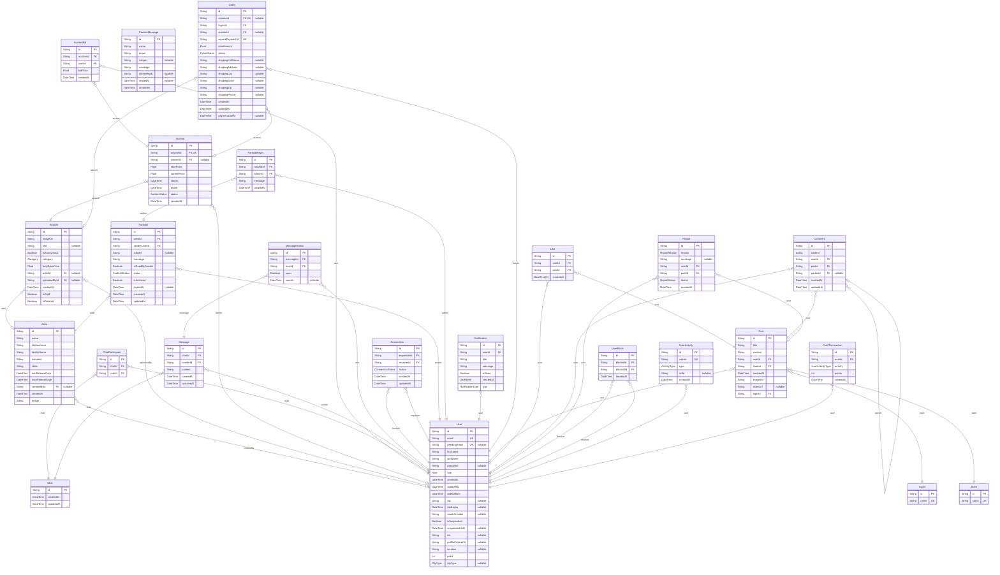

# Prisma Markdown

> Generated by [`prisma-markdown`](https://github.com/samchon/prisma-markdown)

- [default](#default)

## default

### `Artist`

Properties as follows:

- `id`:
- `name`:
- `lifeSentence`:
- `facilityName`:
- `inmateId`:
- `state`:
- `minReleaseDate`:
- `maxReleaseDate`:
- `createdById`:
- `createdAt`:
- `image`:

### `Artwork`

Properties as follows:

- `id`:
- `imageUrl`:
- `title`:
- `isAnonymous`:
- `category`:
- `buyItNowPrice`:
- `artistId`:
- `uploadedById`:
- `createdAt`:
- `isSold`:
- `isDeleted`:

### `Auction`

Properties as follows:

- `id`:
- `artworkId`:
- `winnerId`:
- `startPrice`:
- `currentPrice`:
- `startAt`:
- `endAt`:
- `status`:
- `createdAt`:

### `AuctionBid`

Properties as follows:

- `id`:
- `auctionId`:
- `userId`:
- `bidPrice`:
- `createdAt`:

### `Chat`

Properties as follows:

- `id`:
- `createdAt`:
- `updatedAt`:

### `ChatParticipant`

Properties as follows:

- `id`:
- `chatId`:
- `userId`:

### `Message`

Properties as follows:

- `id`:
- `chatId`:
- `senderId`:
- `content`:
- `createdAt`:
- `updatedAt`:

### `MessageStatus`

Properties as follows:

- `id`:
- `messageId`:
- `userId`:
- `seen`:
- `seenAt`:

### `Connection`

Properties as follows:

- `id`:
- `requesterId`:
- `receiverId`:
- `status`:
- `createdAt`:
- `updatedAt`:

### `ContactMessage`

Properties as follows:

- `id`:
- `name`:
- `email`:
- `subject`:
- `message`:
- `adminReply`:
- `repliedAt`:
- `createdAt`:

### `FanMail`

Properties as follows:

- `id`:
- `artistId`:
- `senderUserId`:
- `subject`:
- `message`:
- `isReadBySender`:
- `status`:
- `isArchived`:
- `repliedAt`:
- `createdAt`:
- `updatedAt`:

### `FanMailReply`

Properties as follows:

- `id`:
- `fanMailId`:
- `adminId`:
- `message`:
- `createdAt`:

### `Notification`

Properties as follows:

- `id`:
- `userId`:
- `title`:
- `message`:
- `isRead`:
- `createdAt`:
- `type`:

### `Order`

Properties as follows:

- `id`:
- `artworkId`:
- `buyerId`:
- `auctionId`:
- `squarePaymentId`:
- `totalAmount`:
- `status`:
- `shippingFullName`:
- `shippingAddress`:
- `shippingCity`:
- `shippingState`:
- `shippingZip`:
- `shippingPhone`:
- `createdAt`:
- `updatedAt`:
- `paymentDueAt`:

### `Post`

Properties as follows:

- `id`:
- `title`:
- `content`:
- `userId`:
- `stateId`:
- `createdAt`:
- `imageUrl`:
- `videoUrl`:
- `topicId`:

### `State`

Properties as follows:

- `id`:
- `name`:

### `Topics`

Properties as follows:

- `id`:
- `name`:

### `Like`

Properties as follows:

- `id`:
- `userId`:
- `postId`:
- `createdAt`:

### `Comment`

Properties as follows:

- `id`:
- `content`:
- `userId`:
- `postId`:
- `parentId`:
- `createdAt`:
- `updatedAt`:

### `Report`

Properties as follows:

- `id`:
- `reason`:
- `message`:
- `userId`:
- `postId`:
- `status`:
- `createdAt`:

### `User`

Properties as follows:

- `id`:
- `email`:
- `pendingEmail`:
- `firstName`:
- `lastName`:
- `password`:
- `role`:
- `createdAt`:
- `updatedAt`:
- `dateOfBirth`:
- `otp`:
- `otpExpiry`:
- `oauthProvider`:
- `isSuspended`:
- `suspendedUntil`:
- `bio`:
- `profilePictureUrl`:
- `location`:
- `point`:
- `otpType`:

### `UserBlock`

Properties as follows:

- `id`:
- `blockerId`:
- `blockedId`:
- `createdAt`:

### `UserActivity`

Properties as follows:

- `id`:
- `userId`:
- `type`:
- `refId`:
- `createdAt`:

### `PointTransaction`

Properties as follows:

- `id`:
- `userId`:
- `activity`:
- `points`:
- `createdAt`:
